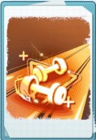
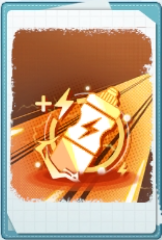
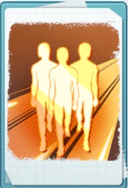
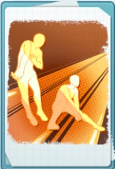
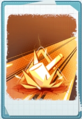
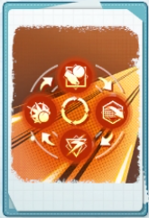

# ETERNAL MATCH — エターナルマッチ

---

## GIẢI THÍCH LUẬT

### エターナルマッチ — Eternal Match

1. **Thời gian mở:** "Eternal Match" được mở trong thời gian giới hạn. Xem chi tiết trên màn hình chính hoặc màn hình sự kiện.
2. **Đội hình:** Tất cả thành viên được thống nhất ở **Rank 6 · Lv.80**. Tiềm Năng, Memory, Huấn Luyện Viên, cấp độ kỹ năng của thành viên và nhân vật cổ vũ phản ánh trạng thái phát triển thực tế của người chơi. Hiệu ứng tăng thông số từ "Phần Thưởng Bộ Sưu Tập" cũng được áp dụng.
3. **Nhiệt Huyết (熱量):** Khi xóa Stage trong "Eternal Match", nhận được Nhiệt Huyết. Khi Nhiệt Huyết tăng cấp, nhận được phần thưởng.

### アチーブメント — Thành Tích

1. **Thành Tích:** Trong thời gian sự kiện, hoàn thành Thành Tích để nhận phần thưởng.
2. **Nhận phần thưởng:** Việc nhận phần thưởng là **thủ công**. Sau khi sự kiện kết thúc, phần thưởng chưa nhận sẽ không thể nhận được nữa.

### マッチショップ — Cửa Hàng

1. **Cửa Hàng Eternal Match:** Trong thời gian sự kiện, khi xóa stage hoặc hoàn thành Thành Tích, nhận được **Huy Hiệu Eternal Match**. Huy Hiệu có thể đổi lấy các vật phẩm tại "Cửa Hàng Eternal Match". Sau khi sự kiện kết thúc, Huy Hiệu chưa sử dụng sẽ bị reset.
2. **Cửa Hàng Chiến Thuật Memo:** Khi nhận trùng Chiến Thuật Memo đã sở hữu, nó tự động phân giải thành **Đồng Xu Chiến Thuật**. Đồng Xu Chiến Thuật có thể đổi lấy Chiến Thuật Memo chưa sở hữu hoặc các vật phẩm khác tại "Cửa Hàng Chiến Thuật Memo". Sau khi sự kiện kết thúc, Đồng Xu chưa sử dụng sẽ bị reset.

### 戦術メモ — Chiến Thuật Memo (Thẻ Chiến Thuật)

1. **Loại thẻ:** Chiến Thuật Memo được chia thành nhiều danh mục, mỗi danh mục có nhiều loại khác nhau. Mỗi loại có **4 độ hiếm**: xanh lá, xanh dương, tím, cam.
2. **Trang bị:** Người chơi trang bị **6 Chiến Thuật Memo** để thi đấu trong Stage, Nghiên Cứu Chiến Thuật và Eternal EX. Không thể trang bị trùng cùng một loại.
3. **Khi nhận trùng:** Tự động phân giải thành Đồng Xu Chiến Thuật (xem mục Cửa Hàng ở trên).

### ステージ — Stage

1. **Stage:** "Stage" trong "Eternal Match" có **7 giai đoạn**, mỗi giai đoạn có **5 stage**.
2. **Độ khó:** Độ khó tăng dần theo giai đoạn.
3. **Thử thách:** Không giới hạn số lần thử thách. Tuy nhiên, **stage đã xóa không thể thử thách lại**.

### 戦術研究 — Nghiên Cứu Chiến Thuật

1. **Giới hạn lần chơi:** Mỗi ngày có thể thực hiện tối đa **5 lần** Nghiên Cứu Chiến Thuật. Số lần nghiên cứu giảm khi thắng trận.
2. **Phần thưởng:** Trong Nghiên Cứu Chiến Thuật, có thể nhận được Chiến Thuật Memo.
3. **Làm mới trận:** Mỗi ngày có thể làm mới trận đấu tối đa **20 lần**. Tùy loại Nghiên Cứu Chiến Thuật, nhận được các Chiến Thuật Memo khác nhau.
4. **Reset:** Số lần nghiên cứu và số lần làm mới được reset vào **06:00 mỗi ngày**.

### エターナルEX — Eternal EX

1. **Eternal EX:** "Eternal EX" gồm **7 stage**. Phần thưởng Tổng Sức Mạnh Tối Đa và phần thưởng Xếp Hạng được tính **độc lập** cho từng stage.
2. **Phần thưởng Tổng Sức Mạnh Tối Đa:** Trong thời gian sự kiện, phần thưởng được phân phát dựa theo Tổng Sức Mạnh Tối Đa mà người chơi đạt được ở mỗi stage.
3. **Phần thưởng Xếp Hạng:** Xếp hạng được xác định theo Tổng Sức Mạnh Tối Đa đạt được ở từng stage. Sau khi sự kiện kết thúc, phần thưởng theo thứ hạng cuối cùng được gửi qua **mail**.
4. **Mở Stage:** Để mở stage "Eternal EX", cần thỏa mãn đồng thời hai điều kiện:
   - ① Xóa stage "Eternal EX" trước đó
   - ② Xóa "Eternal Match · Stage" được chỉ định (có thể kiểm tra trên màn hình stage "Eternal EX" chưa mở)
5. **Thông tin Stage:** Bằng cách điều chỉnh Chiến Thuật Memo và đội hình theo hiệu ứng stage được hiển thị trong thông tin stage, có thể đạt Tổng Sức Mạnh cao hơn.

---

## VẬT PHẨM

> **Hiệu ứng chung của tất cả thẻ:** Chỉ số chính của thành viên ra sân tăng **360**

### スタミナ配分 — Phân Phối Thể Lực

- Mỗi set, khi thể lực của một thành viên phe ta lần đầu giảm xuống dưới **60**, thành viên đó ngừng tiêu hao thể lực và chỉ số chính tăng thêm **100%** đến cuối rally tiếp theo.

### 速攻のバフ — Buff Tốc Công

- Số lượng tag [Tốc công] của phe ta tăng thêm **2**
- Hiệu ứng đặc tính tăng **20%**

### スタミナ補給 — Bổ Sung Thể Lực

- Khi kết thúc mỗi rally, thành viên phe ta hồi phục **12** thể lực.

### 燃える闘志 — Ý Chí Bùng Cháy

- Khi thành viên phe ta chạm bóng, [Tinh thần đội] của phe ta tăng **5** và [Đập mạnh] của thành viên đang có hiệu ứng [絶好調] tăng **80%**.

### 士気の鼓舞 — Khích Lệ Sĩ Khí

- Thời gian duy trì [Tinh thần đội giác ngộ] của phe ta tăng thêm **8** lần.

### 勢いで制す — Chế Ngự Bằng Khí Thế

- Trong khi phe ta đang kích hoạt [Tinh thần đội giác ngộ], chỉ số chính của thành viên phe ta tăng **50%**.

### 攻撃のバフ — Buff Tấn Công

- Khi [Nhận thức] của thành viên phe ta vượt quá **100%**, cứ mỗi **1%** vượt quá, [Kỹ thuật tấn công] tăng thêm **1.2%**, tối đa **50%**.

### 流れを作る — Tạo Đà Thắng

- Khi thành viên phe ta Giao Bóng, Tung Bóng hoặc Đập Bóng (Đập mạnh/Tốc công), [Nhận thức] tăng **80%**.

### 精密なトス — Tung Bóng Chính Xác

- [Tung bóng] của thành viên phe ta tăng **40%**. Hồi chiêu của tuyệt chiêu Tung Bóng và Tấn Công Hai Người của phe ta giảm **4** lần bóng qua lưới.

### 追い打ち — Truy Kích

- Khi một thành viên đối phương nhận hiệu ứng bất lợi, phe ta đồng thời tặng thêm **1 stack** [Nản Lòng] cho thành viên đó. Mỗi stack [Nản Lòng] giảm sức mạnh tất cả các pha chạm bóng của thành viên đó **5%** chỉ số tương ứng, kéo dài **1 set**, tối đa **10 stack**. Khi 1 thành viên tích đủ **4 stack** [Nản Lòng], thành viên đó không thể kích hoạt kỹ năng.

### 逆風を乗り越える — Vượt Qua Nghịch Cảnh

- Khi một thành viên phe ta kích hoạt kỹ năng, giải trừ ngẫu nhiên **2** hiệu ứng bất lợi của thành viên đó. Sau khi giải trừ, chỉ số chính của thành viên đó tăng **15%**, tối đa **10 stack**.

### 勢いに乗る — Thuận Đà Thắng

- Khi bắt đầu rally, ứng với mỗi loại hiệu ứng bất lợi mà thành viên đối phương đang có nhiều nhất đang mang, chỉ số chính của thành viên phe ta tăng **20%**.

### 猛烈な攻撃 — Tấn Công Mãnh Liệt

- *(Chỉ áp dụng trong エターナルEX)* Sức mạnh cuối cùng của mỗi pha chạm bóng phe ta tăng **30%**.

### 急速アタック — Tấn Công Tốc Độ

- Hồi chiêu của các kỹ năng thường (không phải tuyệt chiêu) của thành viên phe ta giảm **4** lần bóng qua lưới.

### 脅威のサーブ — Giao Bóng Uy Hiếp

- Khi Giao Bóng Dự Bị thực hiện giao bóng, [Giao bóng] tăng **140%** và không bao giờ giao lỗi.

### チームワーク — Đồng Đội

- Khi Kizuna của trường phe ta được kích hoạt, chỉ số chính của thành viên phe ta tăng **50%**.

### レシーブのバフ — Buff Đỡ Bóng

- Số lượng tag [Đỡ bóng] của phe ta tăng thêm **2**. Hiệu ứng đặc tính tăng **20%**.

### ブロックのバフ — Buff Chắn Bóng

- Số lượng tag [Chắn bóng] của phe ta tăng thêm **2**. Hiệu ứng đặc tính tăng **20%**.

### 強打のバフ — Buff Đập Mạnh

- Số lượng tag [Đập mạnh] của phe ta tăng thêm **2**. Hiệu ứng đặc tính tăng **20%**.

### 攻守両立 — Cân Bằng Công Thủ

- Khi kỹ năng đỡ bóng của thành viên phe ta tạo ra Nice Play, hồi chiêu của kỹ năng Đập mạnh hoặc Tốc công đầu tiên của phe ta sau đó giảm **6** lần bóng qua lưới (tối đa **1 lần/rally**).

### 高速ブロック — Chắn Bóng Tốc Độ

- Khi thành viên phe ta ghi điểm bằng kỹ năng chắn bóng, hồi chiêu của kỹ năng đó được reset.

### 体力回復 — Hồi Phục Thể Lực

- Khi thành viên phe ta kích hoạt kỹ năng, hồi phục **8** thể lực.

### ウォーミングアップ — Khởi Động

- Khi kết thúc rally, thành viên phe ta có thể lực từ **80** trở lên tiêu hao **10** thể lực và chỉ số chính tăng **10%**, tối đa **10 stack**.

### 士気アップ — Tăng Sĩ Khí

- [Tinh thần đội] khởi điểm của phe ta là **120**.

### 意気込み — Quyết Tâm

- Khi kết thúc rally, [Tinh thần đội] của phe ta tăng **30**. Cứ **2 rally** 1 lần, khi một thành viên phe ta nhận hiệu ứng [浮き沈み], hiệu ứng đó bị giải trừ ngay.

### 攻撃の助力 — Hỗ Trợ Tấn Công

- [Sức mạnh] của thành viên phe ta tăng **50%**. Khi chạm bóng của thành viên phe ta không tạo ra Nice Play, [Nhận thức] của thành viên đó tăng **5%**, tối đa **5 stack**.

### 巧みなテクニック — Kỹ Thuật Điêu Luyện

- Khi thành viên phe ta kích hoạt kỹ năng giao bóng, hồi chiêu của kỹ năng đó được reset.

### サーブの極意 — Tinh Hoa Giao Bóng

- Khi kỹ năng giao bóng của thành viên phe ta tạo ra Nice Play, [Tinh thần đội giác ngộ] của đối phương kết thúc.

### ドシャット — Chắn Bóng Tuyệt Đối

- Khi phe ta chắn bóng, nếu thành viên đối phương vừa thực hiện đập bóng (Đập mạnh/Tốc công) đang mang từ **3 stack** [Nản Lòng] trở lên, [Chắn bóng] của thành viên phe ta tăng **70%**.

### 堅牢な守備 — Phòng Thủ Kiên Cố

- Khi Libero phe ta không có mặt trên sân, [Đỡ bóng] của hàng sau phe ta tăng **70%**.

### 強いキズナ — Kizuna Vững Chắc

- Khi số kỹ năng Kizuna đã kích hoạt của phe ta từ **3** trở lên, chỉ số chính của thành viên phe ta tăng **50%**.

### 追い風に乗る — Thuận Gió

- Khi đặc tính đội của phe ta đang ở thế có lợi, chỉ số chính của thành viên phe ta tăng **40%**.

### 抑え込む — Trấn Áp

- Cứ mỗi đặc tính có thể kích hoạt của phe ta, hiệu ứng đặc tính tăng **8%**.

### 優れた実力 — Thực Lực Vượt Trội

- [Tinh thần] của thành viên phe ta tăng **50%**. Khi chạm bóng của thành viên phe ta không tạo ra Nice Play, [Phản xạ] của thành viên đó tăng **5%**, tối đa **5 stack**.

---

## THÀNH VIÊN

*(Chưa có thông tin)*

---

## ĐÁNH GIÁ & XẾP HẠNG

*(Chưa có thông tin)*
